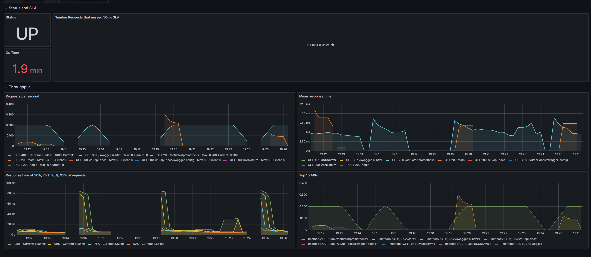
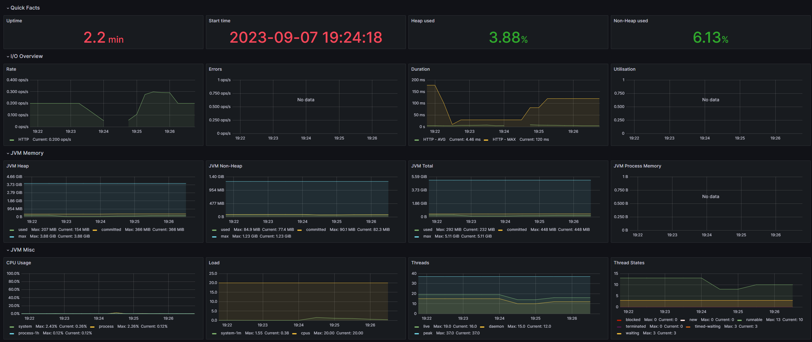
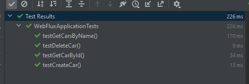
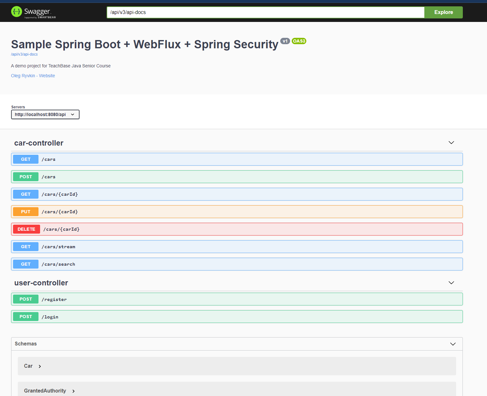

# WebFlux project + MongoDB + JWT + Spring Security + Swagger + Prometheus + Grafana + Docker Compose

Был добавлен Docker Compose для удобства запуска приложения и сервисов мониторинга. 

Для запуска: 

```
docker-compose up --build
```

В Grafana были добавлены две дашборды JVM (Micrometer) и Micrometer Spring Throughput




В JVM микрометре представлена информация о Errors, JVM Heap, JVM Non-Heap, CPU usage, Threads, G1 GC info, Classloading, 
Buffer pools и многое другое. В Спринг микрометре представлена информация о RPS, Response time, TOP 10 API's

Скриншот тест кейсов:



Сваггер (http://localhost:8080/api/swagger-ui.html):

